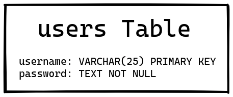

# Code Together!
Code Together! Is a simple collaborative code editor, developed using a privacy first view. This app combines a single page, React frontend with an express driven backend.

## Live Demo
See a [live demo](https://code-2gether.herokuapp.com/) of the app deployed to [Heroku](https://www.heroku.com/)

## Database Schema
Database is very simple, with only one table; 'users' to store usernames and (hashed) passwords.


## Frontend
See the [frontend repo](https://github.com/jonrus/CodeTogether-Frontend) for all of it's commit history.

## Tools Used
- Backend
  - [Express](https://expressjs.com/)
  - [node.bcrypt](https://github.com/kelektiv/node.bcrypt.js)
  - [node-postgres](https://github.com/brianc/node-postgres)
- Frontend
  - [React](https://reactjs.org/)
  - [CodeMirror 6](https://codemirror.net/6/)
    - [Collab Package](https://codemirror.net/6/docs/ref/#collab)
  - [axios](https://github.com/axios/axios)
  - [Reactstrap](https://reactstrap.github.io/)
    - [Bootstrap](https://getbootstrap.com/)
  - [React useWebSocket v2](https://github.com/robtaussig/react-use-websocket)

## Setup/Running
This repo (the backend) only contains the build/bundled version of the frontend. See Frontend above for more info.
- Install node modules ```npm i```
- Seed DB ```psql < dev_seed.sql```
- Build project ```[npx] tsc```
- Start server using nodemon ```npm run dev```

## Tests
Ensure you build the project or the test run will fail.
- Run tests ```[npx] jest```
